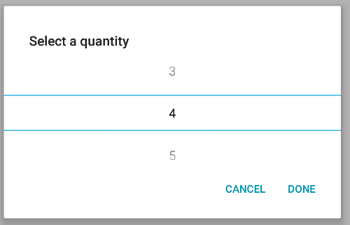
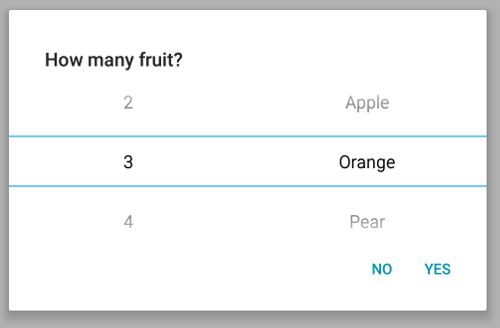
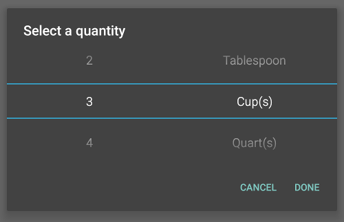
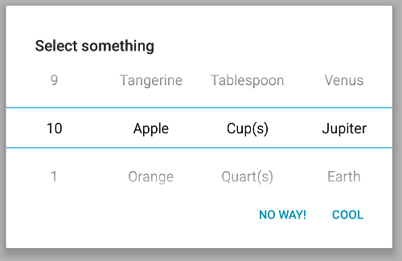

# cordova-wheel-selector-plugin
Wheel selector for Cordova (Android/iOS).

Can use in Cordova or Ionic (v1) frameworks

# Installation

TBD: push to npm registry or something so can have a nicer install


# Usage

## The options that can be set

```
var config = {
    title: "The title",
    items:[
        //how many items to display, see examples below
    ],
    positiveButtonText: "Yes",
    negativeButtonText: "No",
    theme: "light | dark",  //lighter or darker theme
    wrapWheelText: true | false, //wrap the wheel for infinite scroll
    
    //advanced usage:
    displayKey: "description" //so can send in different json TBD: have example for this
    
};

```

# Examples and Screenshots
## Sample Data

Create your data (or get it from a server API call):

```
var data = {
    numbers: [ 
        {description: "1"},
        {description: "2"},
        {description: "3"},
        {description: "4"},
        {description: "5"},
        {description: "6"},
        {description: "7"},
        {description: "8"},
        {description: "9"},
        {description: "10"}
    ],
    fruits: [
        {description: "Apple"},
        {description: "Orange"},
        {description: "Pear"},
        {description: "Banana"},
        {description: "Grapefruit"},
        {description: "Tangerine"}
    ],
    measurements: [
        {description: "Teaspoon"},
        {description: "Tablespoon"},
        {description: "Cup(s)"},
        {description: "Quart(s)"},
        {description: "Packages (7 oz)"},
        {description: "Packages (12 oz)"}
    ],
    planets: [
        {description: "Venus"},
        {description: "Jupiter"},
        {description: "Earth"},
        {description: "Pluto"},
        {description: "Neptune"}
    ]
};


//config here... (see config for each screenshot below to get desired results)
var config = {...};


//do something useful with the result:

window.SelectorCordovaPlugin.showSelector(config, function(result) {
    console.log("result: " + JSON.stringify(result) );
}, function() {
    console.log('Canceled');
});


```

## Single items, white theme
Using config:

```
var config = {
    title: "How Many Fruit?",
    items:[
        [data.numbers],
        [data.fruit]
    ],
    positiveButtonText: "Yes",
    negativeButtonText: "No"
};

```
Produces: 




## 2 items white theme
Using config:

```
var config = {
    title: "Select a quantity",
    items:[
        [data.numbers]
    ],
    positiveButtonText: "Done",
    negativeButtonText: "Cancel"
};

```
Produces: 




## 2 items dark theme
Using config:

```
var config = {
    title: "Select a quantity",
    items:[
        [data.numbers],
        [data.measurements]
    ],
    theme: "dark",
    positiveButtonText: "Done",
    negativeButtonText: "Cancel"
};

```
Produces: 




## Many items dark theme, with 'wheel wrapping'
Using config:

```
var config = {
    title: "Select something",
    items:[
        [data.numbers],
        [data.fruits],
        [data.measurements],
        [data.planets]
    ],
    wrapWheelText: true,
    positiveButtonText: "Cool",
    negativeButtonText: "No way!"
};

```
Produces: 




# TODO
* implement ios portion
* implement normal web browser portion so can run locally in desktop browser